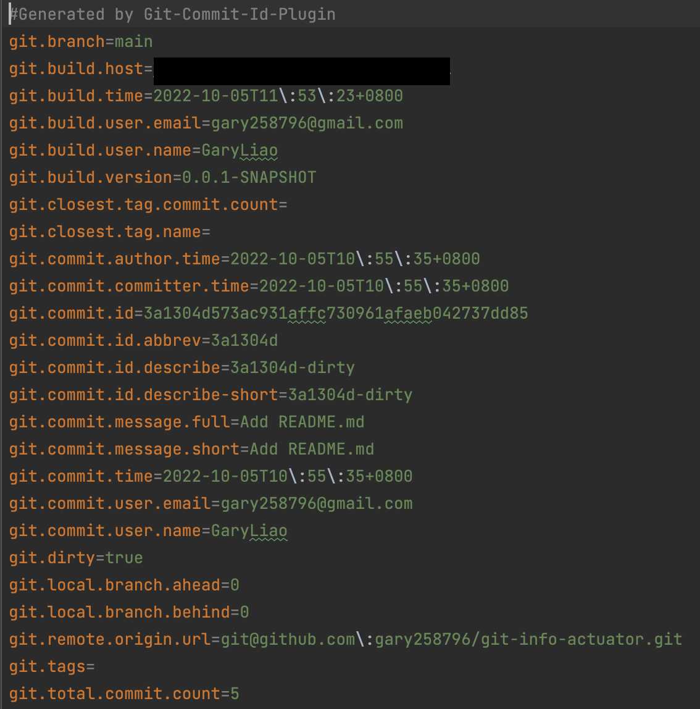

# git-info-actuator

* [Overall](#overall)
* [Quick Go Through](#quick-go-through)
* [Add Dependencies](#add-dependencies-into-pomxml)
* [Add Plugin](#add-plugin-into-pomxml)
* [Run maven command](#run-maven-command)
* [Expose using SpringBoot Actuator](#expose-using-springboot-actuator)
* [Expose using Custom EndPoint](#expose-using-custom-endpoint)
* [Expose using Custom RestControllerEndPoint](#expose-using-custom-restcontrollerendpoint)

## Overall

* From doc from [Spring.io](https://docs.spring.io/spring-boot/docs/current/reference/html/howto.html#howto.build.generate-git-info), it tells what plugin we should use to get git information for us, including Maven and Gradle.
* Also, from doc from [Spring.io](https://docs.spring.io/spring-boot/docs/current/reference/html/actuator.html#actuator.endpoints.info.git-commit-information)
  > 1. Plugin will generate **git.properties** file automatically. 
  > 2. A **GitProperties** bean is autoconfigured if a git.properties file is available at the root of the classpath
  > 3. If a **GitProperties** bean is available, you can use the info endpoint to expose these properties.
* So, we will first expose git infos into /info endpoint provided by SpringBoot actuator.
* And if this isn't enough, we customize an /endpoint specific for showing git-infos.
* Secure our endpoint if it contains some info we wouldn't want anybody to see.
  * Option 1: Secure your endpoint with [Spring Security](https://www.amitph.com/how-to-secure-spring-boot-actuator-endpoints/)
* Only expose endpoint within specific environment
  * Option 1: By setting properties with different values in different environment, and use [@ConditionalOnProperty](https://docs.spring.io/spring-boot/docs/current/api/org/springframework/boot/autoconfigure/condition/ConditionalOnProperty.html) to decide.   Check Class [GitCustomRestControllerEndPoint](https://github.com/gary258796/git-info-actuator/blob/main/src/main/java/gary/framework/gitinfoactuator/endpoint/GitCustomRestControllerEndPoint.java)
  

## Quick Go Through

1. Download and launch SpringBoot application with 8080 port.
2. All endpoints we offer now: [http://localhost:8080/actuator](http://localhost:8080/actuator)
3. /info endpoint: [http://localhost:8080/actuator/info](http://localhost:8080/actuator/info)
4. Custom /git-info endpoint
   * [http://localhost:8080/actuator/git-info](http://localhost:8080/actuator/git-info)
   * [http://localhost:8080/actuator/git-info/true](http://localhost:8080/actuator/git-info/true) -> Which show full detail infos from git commit.
5. Custom /defined-info endpoint
   * [http://localhost:8080/actuator/defined-info/git](http://localhost:8080/actuator/defined-info/git)
   * [http://localhost:8080/actuator/defined-info/git/detail](http://localhost:8080/actuator/defined-info/git/detail) -> Which show full detail infos from git commit.
6. Custom /custom-info endpoint
   * [http://localhost:8080/actuator/custom-info/git/detail](http://localhost:8080/actuator/custom-info/git/detail) -> Which show self-selected detail infos from git commit.

## Add Dependencies into pom.xml

~~~
    <!-- Starter for building web, including RESTful, applications using Spring MVC. Uses Tomcat as the default embedded container -->
    <dependency>
        <groupId>org.springframework.boot</groupId>
        <artifactId>spring-boot-starter-web</artifactId>
    </dependency>

    <!-- Starter for using Spring Boot's Actuator which provides production ready features to help us monitor and manage our application -->
    <dependency>
        <groupId>org.springframework.boot</groupId>
        <artifactId>spring-boot-starter-actuator</artifactId>
    </dependency>
~~~

## Add Plugin into pom.xml

~~~
<build>
      <plugins>
          <plugin>
              <groupId>pl.project13.maven</groupId>
              <artifactId>git-commit-id-plugin</artifactId>
          </plugin>
      </plugins>
  </build>
~~~

## Run maven command
~~~ 
mvn clean compile
~~~

We should be able to see there is a 'git.properties' file under target folder like this.

And the content will be like this

> :star: We can decide what information to be included into git.properties by setting configuration of git plugin.  For more details of configuration, please refer to [plugin_docs](https://github.com/git-commit-id/git-commit-id-maven-plugin/blob/master/docs/using-the-plugin.md)

Say we don't want infos that prefix with 'git.build', we set configuration as
~~~
<plugin>
    <groupId>pl.project13.maven</groupId>
    <artifactId>git-commit-id-plugin</artifactId>
    <configuration>
        <excludeProperties>
             <excludeProperty>git.build.*</excludeProperty>
        </excludeProperties>
    </configuration>
</plugin>
~~~

## Expose using SpringBoot actuator
1. Edit application.properties and add some configuration for actuator
  ~~~
  # Disable all endpoints that SpringBoot Actuator provide by default
  # For this project, we only enable /info endpoint
  management.endpoints.enabled-by-default=false
  management.endpoint.info.enabled=true
  
  # Include only /info endpoint
  management.endpoints.web.exposure.include=info
  
  # full   -> show all info about git commit
  # simple -> show only 'branch, 'commit-id' and 'commit-time'
  management.info.git.mode=full
  
  # Enable git info in order to show in /actuator/info endpoint
  management.info.git.enabled=true
  ~~~
2. Now, start our SpringBoot application, we should be able to access to [http://localhost:8080/actuator/info](http://localhost:8080/actuator/info) and saw git infos.

## Expose using Custom EndPoint

* Add a class annotated with **WebEndPoint** and inject **GitProperties** like below
  > :yum: @ReadOperation is for GET method for our custom endpoint. For further details, please reference to [Spring-docs](https://docs.spring.io/spring-boot/docs/2.1.7.RELEASE/reference/html/production-ready-endpoints.html#production-ready-endpoints-custom-web-predicate-http-method)
  ~~~
  @Component
  @WebEndpoint(id = "git-info")
  public class GitEndPoint {
  
      private final GitProperties gitProperties;
  
      @Autowired
      public GitEndPoint(@Autowired(required = false) GitProperties gitProperties) {
          this.gitProperties = gitProperties;
      }
  
      @ReadOperation
      public GitProperties getGitInfo() {
  
          if (ObjectUtils.isEmpty(gitProperties)) {
              return null;
          }
  
          return this.gitProperties;
      }
  }
  ~~~

* Update our application.properties file, include also our custom endpoint
  ~~~
  # Include only /info endpoint
  management.endpoints.web.exposure.include=info, git-info
  ~~~

* Start our SpringBoot application again, we should be able to get response like below by accessing to [http://localhost:8080/actuator/git-info](http://localhost:8080/actuator/git-info)

  > :warning:  
  > If the info from **GitProperties** are not sufficient, we could directly return the whole content inside the Property file like below, or select needed info ourselves and return. 
  > We should be able to access by [http://localhost:8080/actuator/git-info/true](http://localhost:8080/actuator/git-info/true)
  ~~~
  /**
  * Return detail git info if ${showDetail} is true.
  * @return detail git information
  */
  @ReadOperation
  public Object getGitInfo(@Selector boolean showDetail) {
  
    if (ObjectUtils.isEmpty(gitProperties) || !showDetail) {
        return null;
    }
  
    return getGitDetail();
  }
  
  /**
  * Get all properties from git.properties file
  */
  private Object getGitDetail() {
  
    Properties props;
  
    try {
        props = PropertiesLoaderUtils.loadAllProperties("git.properties");
    } catch (IOException e) {
        throw new RuntimeException(e);
    }
  
    return props;
  }
  ~~~

### Expose using Custom RestControllerEndPoint

Add a [class annotate with @RestControllerEndPoint](https://github.com/gary258796/git-info-actuator/blob/main/src/main/java/gary/framework/gitinfoactuator/endpoint/GitRestControllerEndPoint.java) and define endpoints. 
I personally prefer using RestControllerEndPoint because I can set up endpoints with all familiar annotation when we're developing apis, such as @GetMapping, @PostMapping, @RequestBody...etc. 
Access this endpoint by:
* [http://localhost:8080/actuator/defined-info/git](http://localhost:8080/actuator/defined-info/git)
* [http://localhost:8080/actuator/defined-info/git/detail](http://localhost:8080/actuator/defined-info/git/detail) -> Which show full detail infos from git commit.

### Expose using Custom RestControllerEndPoint with self-selected properties

Add a [class annotate with @RestControllerEndPoint](https://github.com/gary258796/git-info-actuator/blob/main/src/main/java/gary/framework/gitinfoactuator/endpoint/GitCustomRestControllerEndPoint.java) and inject all properties we want using @Value annotation.
> :warning:  
> Remember to let SpringBoot know git.properties in order to inject value by @Value. 
> No matter we choose to achieve by using @PropertySource, config PropertySourcesPlaceholderConfigurer or any ways mentioned in this [article](https://stackabuse.com/how-to-access-property-file-values-in-spring-boot/).

Access this endpoint by:
* [http://localhost:8080/actuator/custom-info/git/detail](http://localhost:8080/actuator/custom-info/git/detail) -> Which show self-selected detail infos from git commit.

### Notice
1. Tracking [issue](https://github.com/git-commit-id/git-commit-id-maven-plugin/issues/590) for personal use of chinese commit message.

## Reference
1. [聊聊如何验证线上的版本是符合预期的版本](https://www.jianshu.com/p/1fe9d5c1d145)
2. [Custom Endpoint in Spring Boot Actuator](https://www.javadevjournal.com/spring-boot/spring-boot-actuator-custom-endpoint/)
3. [Enhancing Spring Boot Actuator with Custom Endpoints](https://medium.com/@jamiekee94/enhancing-spring-boot-actuator-with-custom-endpoints-d6343fbaa1ca#id_token=eyJhbGciOiJSUzI1NiIsImtpZCI6ImVkMzZjMjU3YzQ3ZWJhYmI0N2I0NTY4MjhhODU4YWE1ZmNkYTEyZGQiLCJ0eXAiOiJKV1QifQ.eyJpc3MiOiJodHRwczovL2FjY291bnRzLmdvb2dsZS5jb20iLCJuYmYiOjE2NjQ5NDU2MjgsImF1ZCI6IjIxNjI5NjAzNTgzNC1rMWs2cWUwNjBzMnRwMmEyamFtNGxqZGNtczAwc3R0Zy5hcHBzLmdvb2dsZXVzZXJjb250ZW50LmNvbSIsInN1YiI6IjEwNzg1ODEyNDg2OTA4NTEyNzU4NCIsImVtYWlsIjoiZ2FyeTI1ODc5NkBnbWFpbC5jb20iLCJlbWFpbF92ZXJpZmllZCI6dHJ1ZSwiYXpwIjoiMjE2Mjk2MDM1ODM0LWsxazZxZTA2MHMydHAyYTJqYW00bGpkY21zMDBzdHRnLmFwcHMuZ29vZ2xldXNlcmNvbnRlbnQuY29tIiwibmFtZSI6IkdhcnkgTGlhbyIsInBpY3R1cmUiOiJodHRwczovL2xoMy5nb29nbGV1c2VyY29udGVudC5jb20vYS9BTG01d3UyMmYzdmV2cUFGWURpREM3Um9GNU1oZ3lkSUN1VDJjbG15UTFnbD1zOTYtYyIsImdpdmVuX25hbWUiOiJHYXJ5IiwiZmFtaWx5X25hbWUiOiJMaWFvIiwiaWF0IjoxNjY0OTQ1OTI4LCJleHAiOjE2NjQ5NDk1MjgsImp0aSI6IjFmYTk3NTlkOGY0MjI4MGQwOTcyOTY3MDg5MTAxM2Q5NzM1NjgzZDUifQ.Ue0OtEf64oIx6xO0R4fRCX6u5hZsidLLLif2YYAwcRfZ6J084t8MMUDzaJKRYy5uIwbsjhvuk9TtjeqfKSGnnntFBD_MZlZe3PC7XE3feOQwXbUbt7e5z_1dFVwRW_1Ut-KZRGfNhQS8DM90wfd8PHA0OKszlJp00fVUzi2y85AActk3LT556nGtAWWVV2p0DTEqn3MepKyMu8C-Dp4lt6HJrEDbK2_oAZQJqcw5kOWRzg1tz_Sep0kCo1MEGRuEaiwnl-5wu5XDI6XndrOjE6IHV72xqXsi9M38AWzWcgc-YVtnE3hEzuXktvU_Asn3TzG1wkERCtpOA0gbZdwaPQ)
4. [Injecting Git Information Into Spring](https://www.baeldung.com/spring-git-information)

